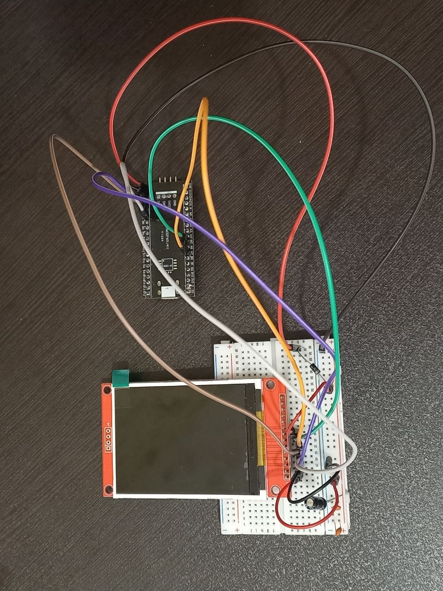

# 🚀 High-Performance ILI9341 SPI LCD Driver on STM32F4

An optimized, bare-metal C driver for the **ILI9341 240x320 TFT LCD** running on the **STM32F401/F411 (WeAct Black Pill)** microcontroller. This repository demonstrates a highly optimized, flicker-free bouncing text animation (screensaver) designed to push bare-metal SPI throughput to its practical limits without using external RTOS or heavy graphics libraries.

<p align="center">
  
</p>

---

## 📌 Features & Engineering Achievements

*   **Flicker-Free Rendering (Dirty Rectangle Clearing)** ⚡  
    Standard full-screen clearing over SPI introduces severe rendering latency. By implementing a custom **Dirty Rectangle** algorithm, only the bounding box of the previous text position is cleared with black pixels before redrawing. This reduces SPI bandwidth utilization per frame by **over 98%**, pushing the rendering speed to a fluid **60+ FPS**.
*   **Direct Pixel Streaming** 🧵  
    Characters are rendered on-the-fly by streaming pixel bytes directly over the SPI transmit register, entirely eliminating the need for large, RAM-consuming frame buffers.
*   **Complete ASCII Font Map** 🔠  
    Features a full 95-character ASCII (32 to 126) 5x7 pixel font array, natively supporting lowercase, uppercase, symbols, and scaling.
*   **Dynamic Color Cycling** 🎨  
    The text dynamically cycles through a pre-defined 16-bit RGB565 color palette upon hitting any of the physical screen boundaries.

---

## 🔌 Hardware Setup & Schematic Enhancements

<p align="center">
  
</p>

### 📐 Circuit Design Choices for Signal Integrity
During initial hardware testing, high-frequency switching on the SPI bus and backlight power transitions introduced transient voltage drops and signal degradation. To resolve these real-world challenges, the following hardware enhancements were implemented:

1.  **Reverse Current Protection:**  
    A low forward-voltage **Schottky Diode** was placed in series with the $+3.3\text{V}$ power line. This prevents any potentially damaging reverse currents from flowing back into the STM32 GPIO rails.
2.  **Transient Voltage Stabilization:**  
    A **$100\mu\text{F}$ electrolytic capacitor** was placed close to the TFT VCC and GND pins to act as a local reservoir, smoothing out voltage sag during high-frequency backlit transitions.
3.  **High-Frequency Decoupling:**  
    Two **$10\text{nF}$ (marked as 103) ceramic capacitors** were connected in parallel between $3.3\text{V}$ and $\text{GND}$ to suppress high-frequency EMI noise generated by the $10.5\text{MHz}$ SPI clock lines.

| ILI9341 Pin | STM32F4 Pin | Description |
| :--- | :--- | :--- |
| **VCC** | 3V3 (via Schottky) | 3.3V Power Supply |
| **GND** | GND | Ground |
| **CS** | PB9 | Chip Select (Active Low) |
| **RESET** | PB7 | Hardware Reset |
| **DC** | PB8 | Data / Command Select |
| **SDI (MOSI)**| PA7 | SPI1 Master Out Slave In |
| **SCK** | PA5 | SPI1 Serial Clock |
| **LED** | PB6 | Backlight Control |

---

## 🛠️ STM32CubeIDE Configuration Steps

To replicate this setup inside **STM32CubeIDE**, configure your `.ioc` file with the following parameters:

### 1. Clock Configuration
*   Set the **System Clock (SYSCLK)** to **84 MHz** (or your maximum supported PLL frequency) to provide fast clock cycles for the SPI peripheral.

### 2. SPI1 Configuration
*   **Mode:** `Full-Duplex Master`
*   **Hardware NSS Signal:** `Disable` (Handled manually via GPIO for software control)
*   **Frame Format:** `Motorola`
*   **Data Size:** `8 Bits`
*   **First Bit:** `MSB First`
*   **Prescaler:** `8` (This yields a stable baud rate of **10.5 MBits/s**, keeping signal integrity intact over breadboard jumpers).
*   **Clock Polarity (CPOL):** `Low`
*   **Clock Phase (CPHA):** `1 Edge` (Mode 0)

### 3. GPIO Configuration
Configure the following pins as **GPIO_Output**:
*   `PB9` (CS) -> Output Push-Pull, High Speed, pull-up.
*   `PB8` (DC) -> Output Push-Pull, High Speed, no pull.
*   `PB7` (RESET) -> Output Push-Pull, High Speed, no pull.
*   `PB6` (LED) -> Output Push-Pull, High Speed, no pull.

---

## 💾 How to Build and Run

1.  Clone this repository:
    ```bash
    git clone https://github.com/SepSR/stm32f4-ili9341-driver.git
    ```
2.  Open **STM32CubeIDE** and import this project.
3.  Modify the displayed text directly in the code:
    ```c
    // Located at the top of main.c
    #define USER_TEXT "SEPSR"
    ```
4.  Build the project and flash it onto your **Black Pill** board using an **ST-Link v2/v3** programmer.

---

## 🎓 Research Interests & Future Work
This implementation forms a baseline for my research in embedded systems and real-time visualization. My future goals include:
*   Integrating **DMA (Direct Memory Access)** to perform asynchronous SPI transfers, freeing up CPU cycles for sensor fusion processing.
*   Porting the driver to a **Real-Time Operating System (FreeRTOS)** environment to evaluate task-scheduling overhead in high-frequency display loops.
